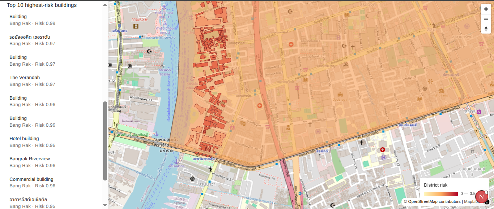
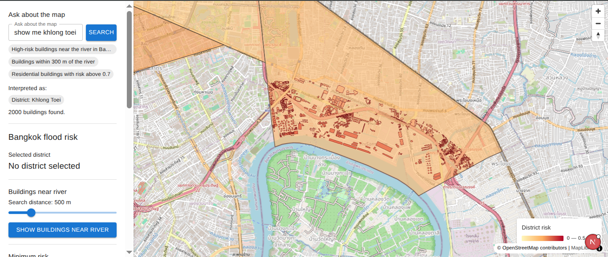
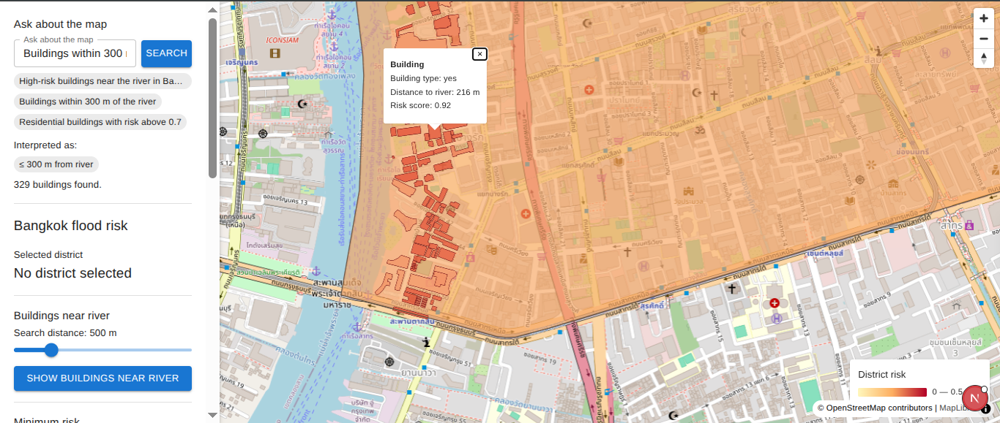
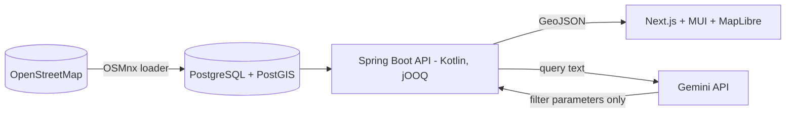

# Bangkok Flood Risk Map

A full-stack geospatial web app that maps ~19,900 OpenStreetMap buildings in three central Bangkok districts and scores each one with an **illustrative** flood-exposure score. You can explore the map, click districts and buildings, and ask questions in plain language, such as *"high-risk buildings within 300 m of the river in Bang Rak"*.

Built as a portfolio project for a Full-Stack Developer internship at Landometer, using the stack from the job description: Kotlin, Spring Boot, jOOQ, PostgreSQL/PostGIS, Next.js, TypeScript, Material UI, MapLibre and an LLM (Gemini).

> **Not real flood data.** The risk score is a simple demo model based on distance to the Chao Phraya river and building height. It must not be used for real flood-risk decisions. See [Limitations](#limitations).

## Screenshots

| Districts and risk colours | Natural-language search | Building popup and top-10 list |
|---|---|---|
|  |  |  |

## Features

- District map coloured by average risk (choropleth); click a district to load its buildings
- "Buildings near the river" slider (100-2000 m) using a real spatial query
- Minimum-risk filter, building popups (name, type, floors, distance to river, score)
- Top-10 highest-risk buildings list; click an item to fly the map to it
- **Natural-language search** powered by Gemini, with a keyword fallback when no API key is set
- One-command setup with Docker Compose

## Architecture



1. `infra/load_osm.py` downloads districts, building footprints and the river with OSMnx and loads them into PostGIS.
2. SQL migrations create the tables, a risk view, and a **materialized view** (`building_risk`) with spatial indexes.
3. The Kotlin/Spring Boot API runs spatial queries through jOOQ and returns GeoJSON.
4. The Next.js frontend draws the data with MapLibre and talks to the API.

## Run it

Requirements: Docker with Compose. About 4 GB of free RAM is recommended for the first build.

```bash
git clone <your-repo-url>
cd <repo-folder>
cp .env.example .env            # optional: add a Gemini key (see below)
docker compose up --build -d
docker compose --profile load run --rm loader   # downloads OSM data, takes a few minutes
```

Open **http://localhost:3000**. The API runs at http://localhost:8081.

To stop it: `docker compose down` (add `-v` to also delete the database).

### Gemini key (optional)

Search works without a key, using simple keyword matching. For AI interpretation, create a key in [Google AI Studio](https://aistudio.google.com) and set these in `.env`:

```
GEMINI_API_KEY=your-key
GEMINI_MODEL=model-name-from-ai-studio
```

The key is read only by the backend and never sent to the browser.

### Development setup

`infra/docker-compose.yml` runs only the database. Then run the backend with `./gradlew bootRun -x jooqCodegen` in `backend/` and the frontend with `npm run dev` in `frontend/`. Stop the full stack first, because both use port 5433.

## API

| Method | Endpoint | Description |
|---|---|---|
| GET | `/api/districts` | Districts with average risk and building count (GeoJSON) |
| GET | `/api/districts/{id}/buildings` | Buildings of one district with risk score |
| GET | `/api/buildings/near-river?meters=N` | Buildings within N metres of the river (`ST_DWithin`) |
| GET | `/api/buildings/top-risk?limit=10&districtId=` | Highest-risk buildings |
| POST | `/api/search` | Natural-language search: `{"query": "..."}` |

## Design decisions

- **Risk score:** `0.7 x (1 - distance_to_river / 2000 m)` plus `0.3 x height factor`, where low-rise buildings (and buildings with unknown floors) score higher. Distances use `geography` so they are in metres.
- **Materialized view:** computing river distances for ~19,900 buildings on every request took 6-14 s. Storing the result with indexes brought requests under one second.
- **Plain SQL through jOOQ's `DSLContext`:** code generation does not understand PostGIS geometry columns, so geometry is returned only through `ST_AsGeoJSON` in plain SQL.
- **The LLM never writes SQL.** Gemini returns four filter parameters (district, maximum river distance, minimum risk, building type) using a JSON schema. The backend validates and clamps them against known values, then runs one parameterised query.
- **Resilience:** a rule-based fallback is used when the key is missing or the call fails, identical queries are cached for 10 minutes, and each IP is limited to 10 searches per minute to protect the free quota.

## Limitations

- Covers only **three districts** (Pathum Wan, Bang Rak, Khlong Toei) and the **Chao Phraya** river. Canals are not included.
- The score is illustrative. It uses no elevation, rainfall, drainage or historical flood data.
- OpenStreetMap floor and name data are incomplete, and buildings with unknown floors are treated as low-rise.
- Search is capped at 2,000 buildings per request.

## Future work

- More districts, canals, and real elevation or flood-extent data
- Vector tiles instead of GeoJSON for larger areas
- 3D building layer (MapLibre `fill-extrusion` or deck.gl)
- Automated tests for the API and the search validation

## Tech stack

Kotlin, Spring Boot 4, jOOQ, PostgreSQL 16 + PostGIS 3.4, Next.js, TypeScript, Material UI, MapLibre GL, OSMnx (Python), Gemini API, Docker Compose.

Map data (c) OpenStreetMap contributors.